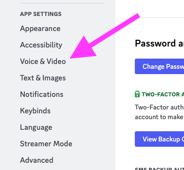
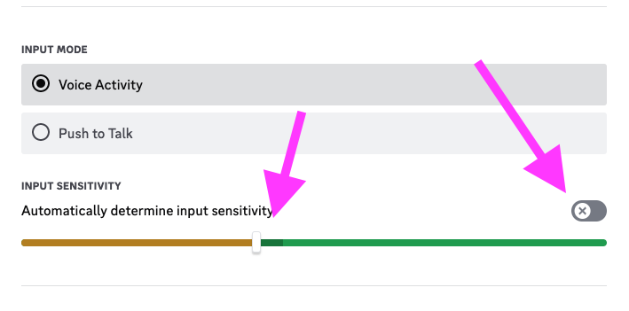
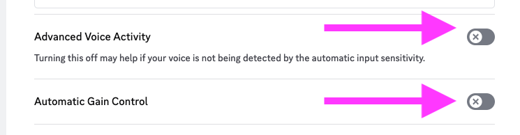

Discord is configured for a single person, single mic by default.
However you can handle it to handle many people using a single mic, e.g. a meeting room setup.

Since this has come up a few times, here is the instructions.

1. Go to Your Settings

2. Go to the Voice & Video Settings

3. Turn Off Automatic Input Sensitivity and Adjust the Sensitivity. You can see the noise your mic picks up in the dark moving area

4. Turn Off Advanced Voice Activity and Automatic Gain Control

